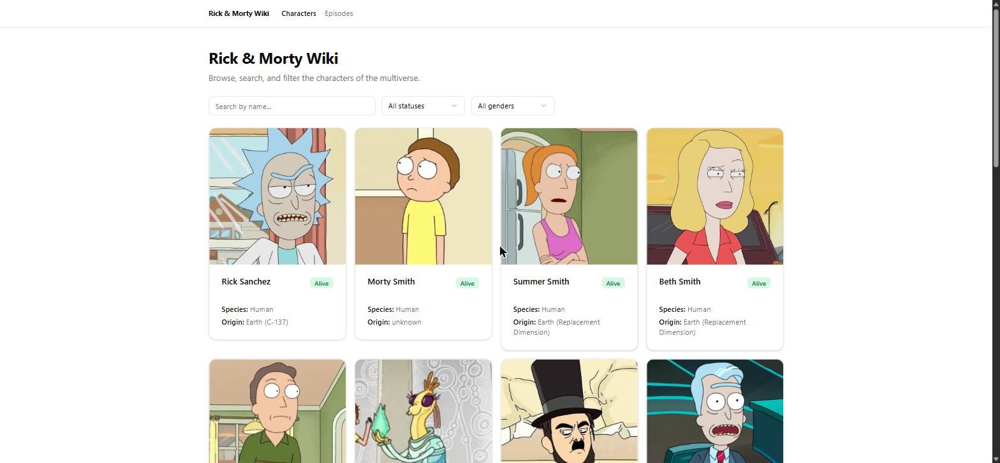

# Rick & Morty Wiki

[](https://github.com/omairab2/rick-morty-wiki-react/actions/workflows/ci.yml)
[](https://rick-morty-wiki-react.vercel.app/)


A Rick & Morty wiki SPA built with **React 19 + TypeScript** following **Clean
Architecture**. Data comes from the public [Rick and Morty API](https://rickandmortyapi.com/).

**🔗 Live demo:** https://rick-morty-wiki-react.vercel.app/

## Overview

- **Characters list** (`/`) — responsive grid of character cards with name
  search (debounced), status & gender filters, and pagination. All filters and
  the current page live in the **URL** (shareable, survives refresh and
  back/forward).
- **Character detail** (`/characters/:id`) — large image, status/species/origin
  /location, and the episodes the character appears in. A breadcrumb returns to
  the exact filtered list it was opened from. Handles loading (skeleton),
  **404 not-found**, and generic errors (with retry) distinctly.
- **Episodes** (`/episodes`) and **Locations** (`/locations`) — the same
  list → detail flow: URL-driven search/filters and pagination, with detail views
  that reuse the character cards (an episode's cast, a location's residents). Each
  feature owns its repository port; cross-entity fetches live on that port.



## Tech stack

| Concern      | Choice                                                   |
| ------------ | -------------------------------------------------------- |
| Build / dev  | Vite 8 + `@vitejs/plugin-react`                          |
| Language     | TypeScript 6                                             |
| UI           | React 19 · shadcn/ui · Tailwind CSS 4 · Radix primitives |
| Server state | TanStack Query 5                                         |
| Routing      | React Router 7 (lazy routes)                             |
| URL state    | nuqs 2                                                   |
| Forms        | React Hook Form 7 + Zod 4                                |
| Unit tests   | Vitest 4 + Testing Library + MSW 2                       |
| E2E tests    | Playwright (Chromium, against the MSW mocks)             |
| Quality      | ESLint 10 + Prettier 3 + Husky 9 + lint-staged           |

## Architecture

`src/` is split into layers with a **one-way dependency rule**. Inner layers
never import outer ones; infrastructure implements the ports the inner layers
declare.

```
┌──────────────────────────────────────────────────────────┐
│ presentation        React: pages, components, hooks, routes│
│ depends on → application, core, shared                     │
└───────────────────────────┬────────────────────────────────┘
                            ▼
┌──────────────────────────────────────────────────────────┐
│ application         use cases, DTOs (orchestration)        │
│ depends on → core, shared                                  │
└───────────────────────────┬────────────────────────────────┘
                            ▼
┌──────────────────────────────────────────────────────────┐
│ core                entities, value objects, repository    │
│                     PORTS, domain errors                   │
│ depends on → (nothing framework-specific)                  │
└───────────────────────────▲────────────────────────────────┘
                            │ implements ports
┌───────────────────────────┴────────────────────────────────┐
│ infrastructure      API client, repository impls, mappers,  │
│                     MSW handlers, TanStack Query client      │
│ depends on → core, application, shared                       │
└──────────────────────────────────────────────────────────┘

shared/   cross-cutting (config, lib, errors) — usable by every layer.
```

```
src/
├─ core/            # entities, value objects, repository ports, domain errors
├─ application/     # use cases + DTOs
├─ infrastructure/  # http client, api, repositories, mappers, query, mocks (MSW)
├─ presentation/    # app, routes, layouts, pages, components (ui + feature), hooks
└─ shared/          # config, lib, errors, constants, types
```

**Example flow — character detail:** `presentation` (hook) → `application`
(`getCharacterDetail` use case) → `core` (`CharacterRepository` port) ←
`infrastructure` (repository impl → API client → mapper → domain entity).

## Running locally

Requires **Node ≥ 20** and **pnpm**.

```bash
git clone <repo-url>
cd rick-morty-wiki-react
pnpm install
cp .env.example .env   # adjust VITE_API_BASE_URL if needed
pnpm dev               # http://localhost:3000
```

To exercise the UI against mocked data instead of the live API, set
`VITE_ENABLE_MSW=true` in `.env`.

## Testing

**Unit & integration** — Vitest + Testing Library + MSW:

```bash
pnpm test          # watch mode
pnpm test:run      # single run (193 tests across the 4 layers)
pnpm test:coverage # single run + coverage report (text + HTML in coverage/)
pnpm test:ui       # Vitest UI
```

Tests use **MSW** to mock the Rick & Morty API, so they never hit the network.
Every layer is covered: domain logic, use cases, mappers, repository, hooks, and
components/pages (via Testing Library).

**End-to-end** — Playwright (Chromium):

```bash
pnpm exec playwright install --with-deps chromium   # one-time: install the browser
pnpm test:e2e       # run the E2E suite (e2e/)
pnpm test:e2e:ui    # Playwright UI mode
```

Playwright boots the dev server with `VITE_ENABLE_MSW=true`, so the flows run
against the **same MSW mocks** — deterministic and offline. The suite (`e2e/`)
covers the characters list → search/filter → detail → back-to-filtered-list
journey.

## Quality scripts

| Script            | Description                              |
| ----------------- | ---------------------------------------- |
| `pnpm build`      | Type-check (`tsc -b`) + production build |
| `pnpm lint`       | ESLint                                   |
| `pnpm format`     | Prettier check                           |
| `pnpm type:check` | Type-check without emitting              |

A Husky `pre-commit` hook runs `lint-staged` (ESLint + Prettier on staged files).

## Deployment

Deployed on **Vercel** → **[rick-morty-wiki-react.vercel.app](https://rick-morty-wiki-react.vercel.app/)**.
The repo is connected at [vercel.com](https://vercel.com/) (**Add New… → Project → Import**);
Vercel auto-detects Vite and reads [`vercel.json`](vercel.json):

- `framework: vite`, `buildCommand: pnpm build`, `outputDirectory: dist`.
- A SPA rewrite sends every unmatched path to `/index.html` so client-side routes
  (e.g. `/characters/1`, `/episodes/5`) resolve on direct navigation and refresh —
  without it, deep links would 404.

Every push to `main` triggers a production deploy; pull requests get preview
deployments. (The badge above is a one-click "deploy your own copy" link.)

## Technical decisions

Architecture and tooling decisions are recorded as ADRs in
[`docs/decisions/`](docs/decisions/):

- [ADR 001 — Architecture & stack](docs/decisions/001-architecture-decisions.md)
- [ADR 002 — Lazy route splitting](docs/decisions/002-lazy-route-splitting.md)
- [ADR 003 — HttpError in the shared layer](docs/decisions/003-http-error-in-shared-layer.md)

## Roadmap / next steps

- [x] **Episodes** feature (`/episodes`) reusing the same layer flow.
- [x] **Locations** feature (`/locations`) reusing the same layer flow.
- [x] **CI** (GitHub Actions): type-check + lint + unit tests + build, plus a
      Playwright **E2E** job, on every push/PR.
- [x] **Deploy** on Vercel (SPA rewrites via `vercel.json`).
- [x] **E2E tests** (Playwright) for the list → detail → back-with-filters flow.
- [ ] Character detail polish: related characters, episode links.

## Contributing

See [CONTRIBUTING.md](CONTRIBUTING.md) for branch naming, commit conventions, and
how to add a feature across the layers.
